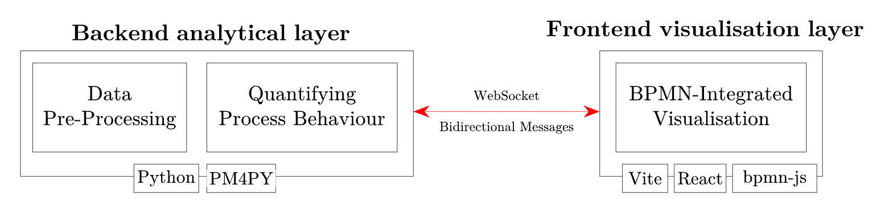

# Process Mining BPMN Visualizer

Process Mining BPMN Visualizer is a web-based proof-of-concept platform developed as part of the dissertation **“BPMN-Preserving Visual Augmentation of Process Mining Diagnostics for Stakeholder-Oriented Process Monitoring”**.

The platform preserves the uploaded BPMN model as the main visual context and augments it with process-mining diagnostics instead of replacing it with a discovered model or detached technical output. The source BPMN model remains unchanged; analytical evidence is rendered as temporary overlays and, when applicable, visually distinct deviation artefacts.

## Features

- Upload a BPMN model and an event log.
- Run a PM4Py-based process-mining pipeline.
- Validate semantic activity mappings between event-log labels and BPMN activities.
- Visualise conformance, frequency, and performance diagnostics on top of the BPMN model.
- Display deviation activities and flows not represented in the original BPMN model.
- Receive live execution updates through WebSockets.

## Architecture

This repository contains:

- A **FastAPI backend** in `platform/backend`
- A **Vite + React frontend** in `platform/frontend`



The backend handles preprocessing, activity mapping, process-mining computation, and execution updates. The frontend handles file upload, BPMN rendering, user interaction, mapping validation, and diagnostic visualisation.

## Prerequisites

Install these tools before starting:

- Python 3.10 or newer
- Node.js 20 or newer
- pnpm

If pnpm is not installed:

```bash
npm install -g pnpm
```

## Environment Variables

Create one `.env` file for the backend and one for the frontend by copying the example files, renaming them to `.env`, and verifying whether you want to change any values.

## Backend `.env`

Copy `platform/backend/.env.example`, rename the copied file to `.env`, and keep it in `platform/backend`.

The backend `.env` contains the FastAPI frontend URL and the configuration values for the activity mapping algorithm:

```env
FRONTEND_URL=http://localhost:5173
EMBEDDING_MODEL=PORTULAN/serafim-100m-portuguese-pt-sentence-encoder
LINGUISTIC_PIPELINE=pt_core_news_sm
ACTION_WEIGHT=0.30
OBJECT_WEIGHT=0.20
FULL_LABEL_WEIGHT=0.25
LEXICAL_WEIGHT=0.10
TOKEN_WEIGHT=0.15
MINIMUM_CANDIDATE_MARGIN=0.05
CANDIDATE_THRESHOLD=0.80
EXPORT_EVALUATION_METRICS=false
```

`FRONTEND_URL` is used by FastAPI CORS middleware to allow requests from the frontend.

The activity-mapping weights should sum to `1.0`.

`EXPORT_EVALUATION_METRICS` can be enabled when running controlled validation to export comparison reports.

## Frontend `.env`

Copy `platform/frontend/.env.example`, rename the copied file to `.env`, and keep it in `platform/frontend`.

Verify the values match your backend address:

```env
VITE_BACKEND_URL=http://localhost:8000
VITE_BACKEND_WS=ws://localhost:8000/ws
```

`VITE_BACKEND_URL` is the HTTP API base URL.

`VITE_BACKEND_WS` is the backend WebSocket base URL used for notebook execution updates.

## Backend Setup

From the repository root:

```bash
cd platform/backend
```

Create a virtual environment:

```bash
python -m venv .venv
```

Activate it on Windows PowerShell:

```powershell
.\.venv\Scripts\Activate.ps1
```

Activate it on macOS/Linux:

```bash
source .venv/bin/activate
```

Install backend dependencies:

```bash
pip install -r requirements.txt
```

Create the Jupyter kernel used by `pipeline.ipynb`:

```bash
python -m ipykernel install --user --name pm4py-venv --display-name "pm4py-venv"
```

Verify that the kernel was created:

```bash
jupyter kernelspec list
```

Start the FastAPI server:

```bash
uvicorn main:app --reload --host 0.0.0.0 --port 8000
```

The backend should now be available at:

```text
http://localhost:8000
```

You can check readiness with:

```text
http://localhost:8000/server/connect
```

## Frontend Setup

Open a second terminal and run:

```bash
cd platform/frontend
```

Install frontend dependencies:

```bash
pnpm install
```

Start the Vite development server:

```bash
pnpm run dev
```

The frontend should now be available at:

```text
http://localhost:5173
```

## Local Development Flow

1. Start the backend from `platform/backend`.
2. Start the frontend from `platform/frontend`.
3. Open `http://localhost:5173`.
4. Wait until the connection indicator is green and says `Connected`.
5. Upload a BPMN model.
6. Upload an event log file.
7. Start the analysis.
8. Validate activity mappings when prompted.
9. Explore the generated diagnostic views.

## Input and Output

Example input files are available in `platform/input`:

- `pp-bpmn-model.bpmn`
- `pp-event-log.xes`

These correspond to the Purchase Process examples used in the dissertation.

The platform expects:

- A BPMN source model.
- A corresponding event log.

The output is an augmented analytical view of the uploaded BPMN model, containing diagnostic overlays and optional deviation artefacts. The uploaded BPMN model is not overwritten.

## Project Context

This project is a research prototype, not a production-ready monitoring system. It was developed to instantiate and evaluate a BPMN-preserving process-mining visualisation method for BPMN-literate stakeholders with limited process-mining expertise.

The dissertation evaluation included controlled technical validation and an exploratory practitioner evaluation.

## Citation

If you use this project in academic work, please cite the related dissertation:

```text
Ferreira, B. (2026). BPMN-Preserving Visual Augmentation of Process Mining Diagnostics for Stakeholder-Oriented Process Monitoring: Validating Process Mining-Augmented BPMN Processes for Non-Expert Stakeholders. University of Leiria and Oeste.
```

## License

MIT License

Copyright (c) 2026 Bruno Ferreira

Permission is hereby granted, free of charge, to any person obtaining a copy
of this software and associated documentation files (the "Software"), to deal
in the Software without restriction, including without limitation the rights
to use, copy, modify, merge, publish, distribute, sublicense, and/or sell
copies of the Software, and to permit persons to whom the Software is
furnished to do so, subject to the following conditions:

The above copyright notice and this permission notice shall be included in
all copies or substantial portions of the Software.

THE SOFTWARE IS PROVIDED "AS IS", WITHOUT WARRANTY OF ANY KIND, EXPRESS OR
IMPLIED, INCLUDING BUT NOT LIMITED TO THE WARRANTIES OF MERCHANTABILITY,
FITNESS FOR A PARTICULAR PURPOSE AND NONINFRINGEMENT. IN NO EVENT SHALL THE
AUTHORS OR COPYRIGHT HOLDERS BE LIABLE FOR ANY CLAIM, DAMAGES OR OTHER
LIABILITY, WHETHER IN AN ACTION OF CONTRACT, TORT OR OTHERWISE, ARISING
FROM, OUT OF OR IN CONNECTION WITH THE SOFTWARE OR THE USE OR OTHER DEALINGS
IN THE SOFTWARE.
